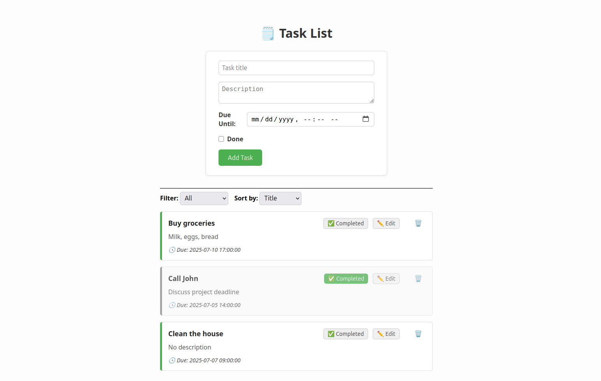

# Tasks Manager

A simple PHP 8.4 task management app using SQLite3. You can run it locally with PHP or inside Docker.



## Features

- **Add, edit, delete tasks**
- **Mark tasks as done/undone**
- **Filter tasks by status (completed or incomplete)**
- **Sort tasks by due date or title**

## Prerequisites

### Local Setup (without Docker)

Make sure you have:

- **PHP 8.4 installed**
- **SQLite3 extension enabled (php-sqlite3)**

### Docker Setup

- **Docker**
- **Docker Compose**

## Getting Started

**Clone the repository:**

```bash
git clone git@github.com:quasiL/task-manager.git
cd task-manager
```

**Running Locally (without Docker)**

```bash
php -S localhost:8000 -t src/public/
```

Run database migrations:

```bash
php src/migrate.php up
```

To rollback the migrations:

```bash
php src/migrate.php down
```

**Running with Docker**

```bash
docker-compose up --build
```

Run database migrations:

```bash
docker exec -it app php /var/www/html/src/migrate.php up
```

To rollback the migrations:

```bash
docker exec -it app php /var/www/html/src/migrate.php down
```

To stop the Docker container:

```bash
docker-compose down
```

## Access the application

http://localhost:8000
